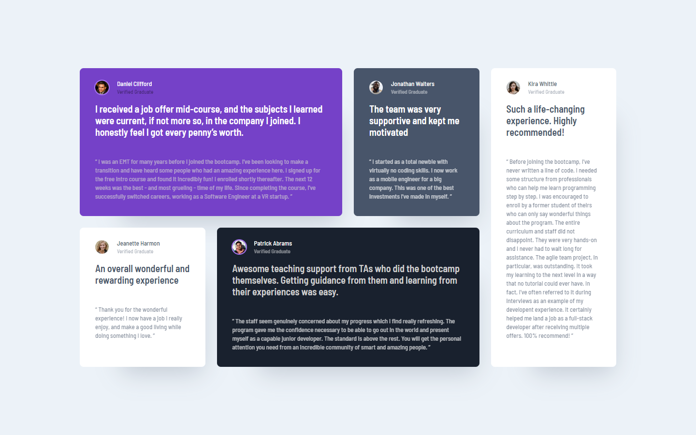

# Frontend Mentor - Testimonials grid section solution

This is a solution to the [Testimonials grid section challenge on Frontend Mentor](https://www.frontendmentor.io/challenges/testimonials-grid-section-Nnw6J7Un7). Frontend Mentor challenges help you improve your coding skills by building realistic projects.

## Overview

### The challenge

Users should be able to:

- View the optimal layout for the site depending on their device's screen size

### Screenshot

### Links

- [Live](https://lonelybuddy.github.io/testimonial-grid-section/)
- [Solution](https://www.frontendmentor.io/solutions/htmlcssscass-NUkygMYdf)

### Built with

- HTML5
- CSS3
- Sass

## Author

- Frontend Mentor - [@Henryzheng](https://www.frontendmentor.io/profile/LonelyBuddy)
